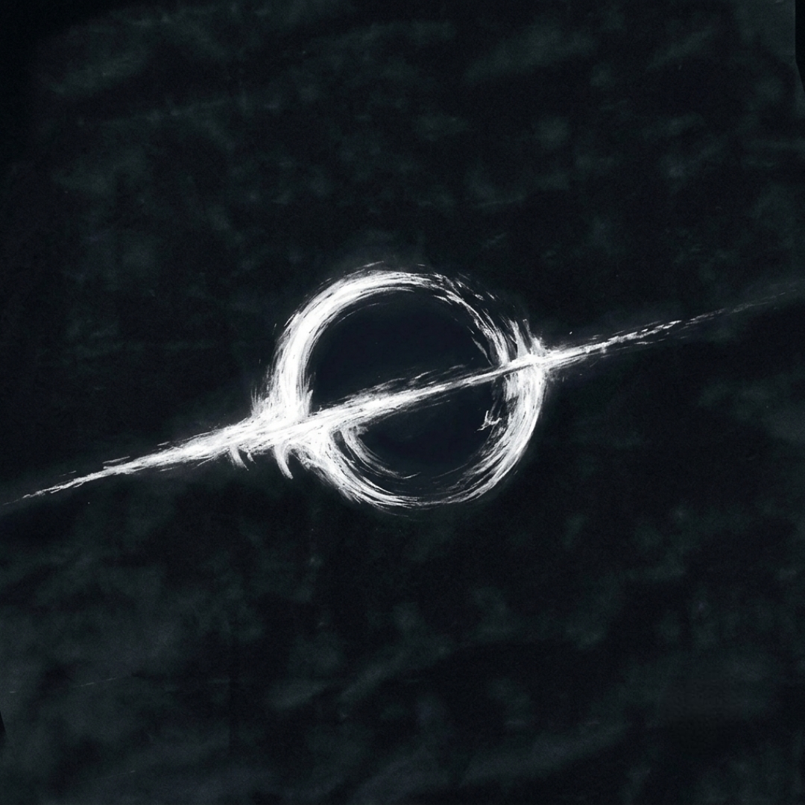
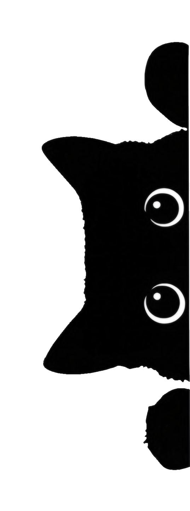

<div align="center">

  

  # Orbit Browser

  **Next-Generation Privacy & Media Streaming Browser for Android**

  [](https://github.com/shubh152205/Orbit/releases)
  [](https://github.com/shubh152205/Orbit)
  [](https://reactnative.dev/)
  [](https://kotlinlang.org/)
  [](LICENSE)

  <br />

  [**⬇️ Download Latest APK**](https://github.com/shubh152205/Orbit/releases/latest/download/orbit-release.apk) • [**✨ Features**](#-key-features) • [**🏗️ Architecture**](#-architecture) • [**🚀 Building from Source**](#-building-from-source)

</div>

---

## 🌌 Overview

**Orbit** is a high-performance Android web browser engineered specifically for seamless video and audio streaming, zero-interruption multitasking, and uncompromising privacy. Built with a custom Chromium WebView bridge, native Kotlin foreground services, and an Apple-inspired Liquid Glass UI, Orbit eliminates intrusive ads and delivers media playback features that standard mobile browsers lack.

---

## ✨ Key Features

### 🛡️ Brave Shields Privacy & Ad-Blocking Engine
- **Network-Level Filter**: Blocks 120+ ad networks, telemetry trackers, and malicious redirect scripts at the native Android network layer before they can load.
- **YouTube Ad Skipper**: Automatically defuses video ads, suppresses sponsor popups, and clicks skip buttons without freezing playback or crashing the Media Source buffer.
- **Cosmetic Filtering**: Real-time procedural CSS rules injected into web pages to remove sponsored slots, empty ad banners, and overlay hijackers.
- **SyntaxError Safeguard**: Blocks API requests cleanly by returning valid empty JSON payloads (`{}`) to prevent player state machine crashes.

### 📺 Picture-in-Picture (PiP) with 3-Action Controls
Matching the official YouTube app PiP experience:
1. 🎧 **Headphones / Audio Mode**: Instantly transitions floating video to background audio streaming, automatically closing the floating window while audio keeps playing.
2. ⏯️ **Play / Pause**: Smooth, real-time media controls synchronized with native media sessions.
3. ⏭️ **Next Track**: Skip to the next video instantly on YouTube and generic HTML5 media players.
- **No Auto-Pause Watchdog**: Suppresses unwanted pauses triggered by browser resize, orientation change, or tab visibility change.
- **Zero-Shrink Layout Fix**: Prevents web video players from collapsing into a miniature box after entering or exiting fullscreen/PiP.

### 🐱 Liquid Glass Dynamic Island & The Peeking Cat
- **Apple Frosted Glass Navigation**: Smooth floating capsule navbar with frosted glass blur, glowing border specular accents, domain security badges, and quick controls.
- **The Peeking Cat (`Show` Trigger)**: When the island is hidden or minimized, a cute peeking cat appears right against the right border of your screen. Tapping the cat triggers a bouncy spring animation and smoothly restores the top navigation island.

### 🎧 Background Audio Mode & Lock Screen Controls
- **Continuous Background Playback**: Keep listening to YouTube, music, podcasts, or livestreams even when your screen is turned off or you are using other apps.
- **Native Android Notification Shade**: Full `MediaSessionCompat` and `MediaStyle` notification with track title, site subtitle, rewind, fast forward, play/pause, and skip next controls.
- **WakeLock & WifiLock**: Prevents Android battery optimizations and Wi-Fi throttling from interrupting your background stream.

### ⚡ Soul Cinema Video Player
- **HTML5 Stream Sniffer**: Automatically detects streaming video URLs on video platforms and cinema portals.
- **Custom Native Media Controls**: Fullscreen landscape rotation (irrespective of system rotation lock), aspect-ratio fitting, playback speed controls, and gesture brightness/volume adjustments.

### 📥 Built-in File & Stream Downloader
- Integrated download manager with background file downloads, progress tracking, and storage access management.

---

## 📱 Screenshots & Visuals

| Liquid Glass Island & Peeking Cat | YouTube 3-Action PiP Mode | Background Audio & Lock Screen |
|:---:|:---:|:---:|
|  |  |  |

---

## 🏗️ Architecture

```
Orbit
├── android/
│   ├── app/src/main/java/com/streamnest/app/
│   │   ├── MainActivity.kt               # Native PiP lifecycle & 3-action broadcast receiver
│   │   ├── MainApplication.kt            # React Native host initialization
│   │   ├── adblock/
│   │   │   ├── BraveNativeEngine.kt      # Native AdBlock & tracker rule evaluator
│   │   │   ├── BraveShieldsModule.kt     # React Native bridge for Shields telemetry
│   │   │   ├── BraveShieldsWebViewClient.kt # Network request interceptor & JSON protector
│   │   │   └── BraveWebView.kt           # Custom Chromium WebView wrapper
│   │   └── media/
│   │       ├── BraveMediaPlaybackService.kt # Foreground media player & MediaSessionCompat
│   │       ├── BackgroundAudioModule.kt  # React Native bridge for background playback
│   │       └── PipModule.kt              # Android 12+ Picture-in-Picture controller
├── src/
│   ├── components/
│   │   ├── BrowserView.tsx               # Production-grade WebView engine & media sniffer
│   │   ├── LiquidGlassNavBar.tsx         # Frosted glass island & Peeking Cat trigger
│   │   ├── LiquidDynamicIsland.tsx       # Dynamic island capsule
│   │   ├── NativeFloatingDock.tsx        # Bottom quick navigation dock
│   │   ├── NativeHomeScreen.tsx          # Favorites, speed-dial portals, & search hub
│   │   ├── NativeSettingsModal.tsx       # Privacy shields & storage configuration
│   │   └── SoulVideoPlayer.tsx           # Cinema mode fullscreen player
│   ├── services/
│   │   ├── braveShields.ts               # Injected adblock scriptlets, JSON defuser & PiP guards
│   │   ├── backgroundAudio.ts            # Foreground service controllers
│   │   └── themeEngine.ts                # Real-time web & native appearance synchronization
│   └── theme/
│       └── tokens.ts                     # Orbit dark & light design tokens
└── assets/                               # Adaptive launcher icons, splash graphics & logos
```

---

## 🚀 Building from Source

### Prerequisites
- **Node.js**: v18+ or v20+
- **pnpm**: `corepack enable && corepack prepare pnpm@latest --activate`
- **JDK**: Java Development Kit 17 (OpenJDK)
- **Android SDK**: Android API level 34+ and Build-Tools 34.0.0+

### Steps

1. **Clone the Repository**:
   ```bash
   git clone https://github.com/shubh152205/Orbit.git
   cd Orbit
   ```

2. **Install Dependencies**:
   ```bash
   pnpm install
   ```

3. **Verify TypeScript Types**:
   ```bash
   npx tsc --noEmit
   ```

4. **Build Release APK**:
   ```bash
   cd android
   ./gradlew assembleRelease
   ```
   The built APK will be located at:
   ```
   android/app/build/outputs/apk/release/app-release.apk
   ```

---

## 📄 License

This project is licensed under the [MIT License](LICENSE).
